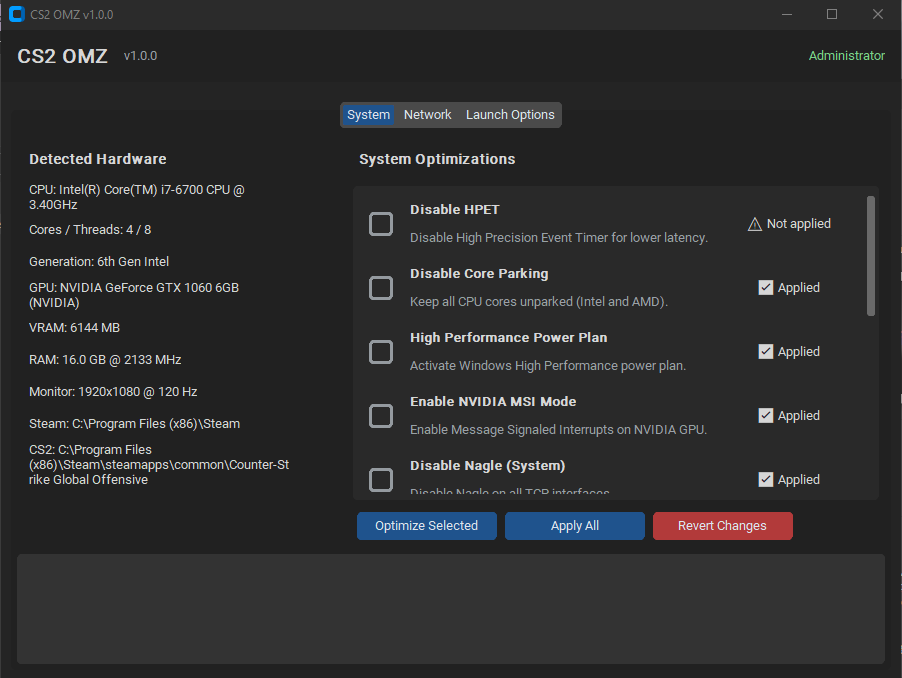
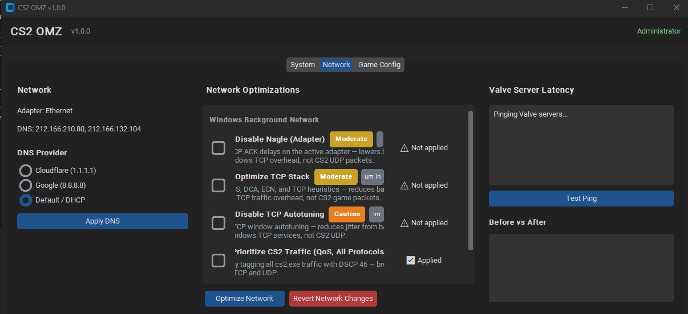
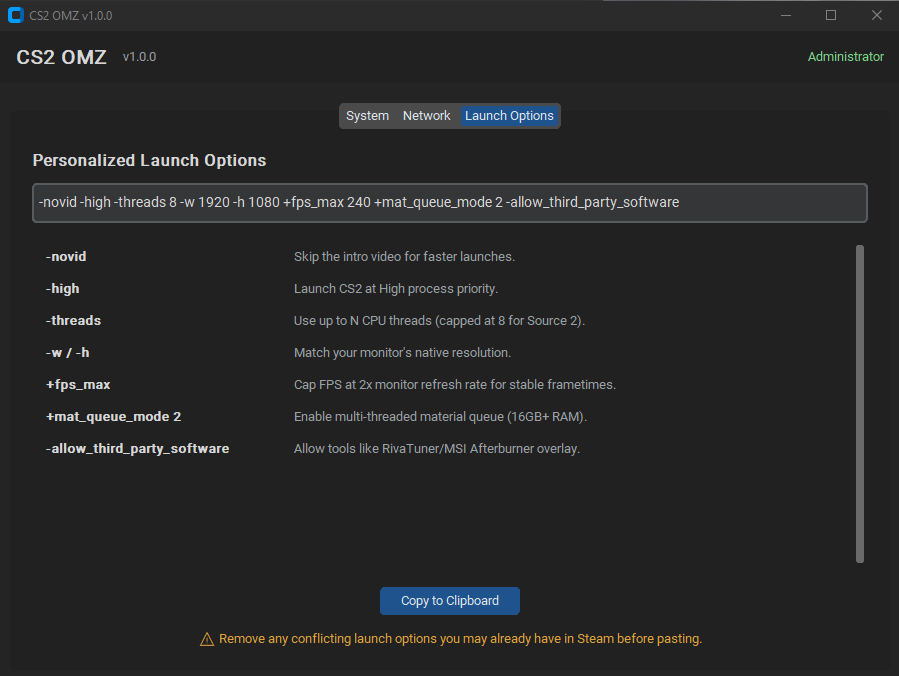

# CS2 OMZ

[](LICENSE)
[]()
[]()

**CS2 OMZ** is a one-click optimizer for Counter-Strike 2 on Windows.
It detects your hardware, applies safe system and network tweaks, and
generates personalized CS2 launch options — all without asking you to
touch the registry, `netsh`, or `powercfg` yourself.



## Origin story

CS2 OMZ was born from a real stuttering problem on an **i7-6700 + GTX 1060**
running CS2. The usual "disable this, tweak that" guides scattered across
Reddit and forums worked, but they required hours of reading and a lot of
trust in random `.reg` files. This tool packages the ones that actually
moved the needle into a single, reversible, auditable app.

## Features

### System Optimizations (`optimizer.py`)
- **Disable HPET** — removes `useplatformclock`, sets `disabledynamictick yes`.
- **Disable Core Parking** — forces `ValueMax=0` on all cores (Intel & AMD).
- **High Performance Power Plan** — activates the classic high-perf scheme.
- **Enable NVIDIA MSI Mode** — message-signaled interrupts on NVIDIA GPUs only.
- **Disable Nagle (System)** — sets `TcpAckFrequency=1`, `TCPNoDelay=1` on every interface.
- **Enable SSD TRIM** — `fsutil behavior set DisableDeleteNotify 0`.
- **Disable CS2 Fullscreen Optimizations** — forces exclusive fullscreen on `cs2.exe`.
- **Disable Xbox Game DVR** — 7 registry keys across HKCU/HKLM.
- **Disable Background Services** — SysMain, DiagTrack, WSearch, PrintSpooler.
- **Optimize Memory Settings** — `DisablePagingExecutive=1`, `LargeSystemCache=0`.
- **Clear CS2 Shader Cache** — wipes CS2 + NVIDIA DX/GL caches for a clean rebuild.
- **Reduce Visual Effects** — Windows "Best performance" preset.



### Network Optimizations (`network.py`)
- **Disable Nagle (Adapter)** — applied to the auto-detected active adapter.
- **Optimize TCP Stack** — RSS on, DCA on, chimney offload off, ECN off, heuristics disabled.
- **Disable TCP Autotuning** — reduces jitter on unstable links.
- **Prioritize CS2 Traffic (QoS)** — creates a DSCP-46 QoS policy for `cs2.exe`.
- **Optimize Network Adapter** — disables power saving, interrupt moderation, EEE, flow control.
- **DNS switcher** — Cloudflare (`1.1.1.1`) / Google (`8.8.8.8`) / revert to DHCP with one click.
- **Valve server ping test** — ping Stockholm, Frankfurt, Warsaw, Madrid before/after and compare.

### Launch Options Generator
Produces a launch string personalized to your detected hardware:
`-novid -high -threads <cores> -w <width> -h <height> +fps_max <Hz*2>` and more.
Explanations for each flag are shown in the GUI.



## How to use

1. Download the latest `CS2OMZ.exe` from the Releases page.
2. Right-click it and choose **Run as administrator**.
3. On the **System** tab, review the auto-detected status of each
   optimization. Pick the ones you want and click **Optimize Selected**,
   or just click **Apply All**.
4. Switch to the **Network** tab. Click **Test Ping** to establish a
   baseline, then **Optimize Network**, then **Test Ping** again to see
   the before/after.
5. On the **Launch Options** tab, click **Copy to Clipboard** and paste
   the result into Steam → right-click CS2 → Properties → Launch Options.
6. Restart your PC so every change takes effect.

Every registry change is backed up to `backups/<tag>_<timestamp>.reg`
before being applied. **Revert Changes** imports the most recent backup.

## Build from source

```bash
git clone https://github.com/your-user/cs2-omz
cd cs2-omz
pip install -r requirements.txt
python main.py
```

To build a single-file signed executable:

```bash
build.bat
```

Output: `dist\CS2OMZ.exe`.

## Contributing

PRs welcome — especially from players on AMD hardware or unusual monitor
setups. Good first issues:

- New optimizations with clear before/after evidence
- Localization (Spanish, Portuguese, Russian first)
- Additional Valve region servers for the ping test
- Screenshots for `assets/screenshots/`

Please keep each optimization:
- Independent (its own function).
- Reversible (registry change → backup first).
- Safe to run twice (idempotent).
- Covered by a `check_*_status()` helper.

## VAC Safe?

**Yes — CS2 OMZ is 100% VAC safe.**

CS2 OMZ only modifies **Windows system settings**: registry keys, services,
power plans, TCP stack parameters, and network adapter properties. It does
**not**:

- Read, write, or modify any CS2 game file.
- Attach to, inject into, or read memory from the `cs2.exe` process.
- Hook DirectX, OpenGL, or any Source 2 API.
- Load drivers or kernel modules.
- Touch anything inside your Steam or CS2 install directory (except for
  the optional **Clear CS2 Shader Cache** action, which deletes Valve's
  own regeneratable shader cache folder — never game code or assets).

Valve Anti-Cheat inspects the CS2 process and its loaded modules. Because
CS2 OMZ runs entirely outside that boundary and exits before you launch
the game, there is nothing for VAC to flag. The launch options it
generates use only documented Source 2 engine flags.

## Disclaimer

CS2 OMZ modifies Windows registry keys, services, and network settings.
Although every change is backed up and reversible, you run this tool
**at your own risk**. Creating a system restore point before first use
is recommended. The authors are not affiliated with Valve, Steam, or
Counter-Strike 2.

## License

[MIT](LICENSE)
